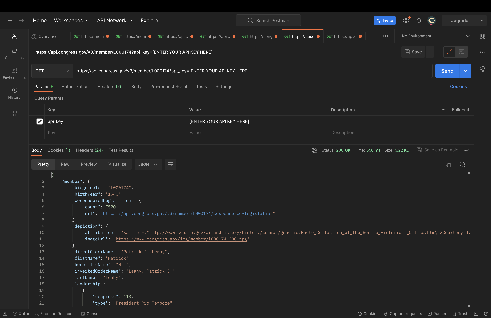
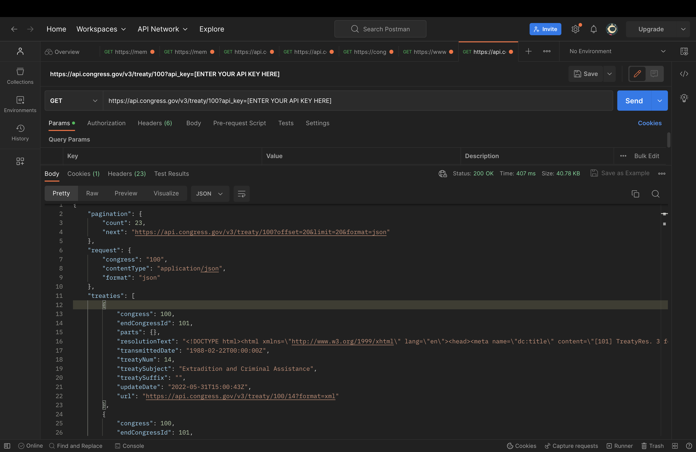
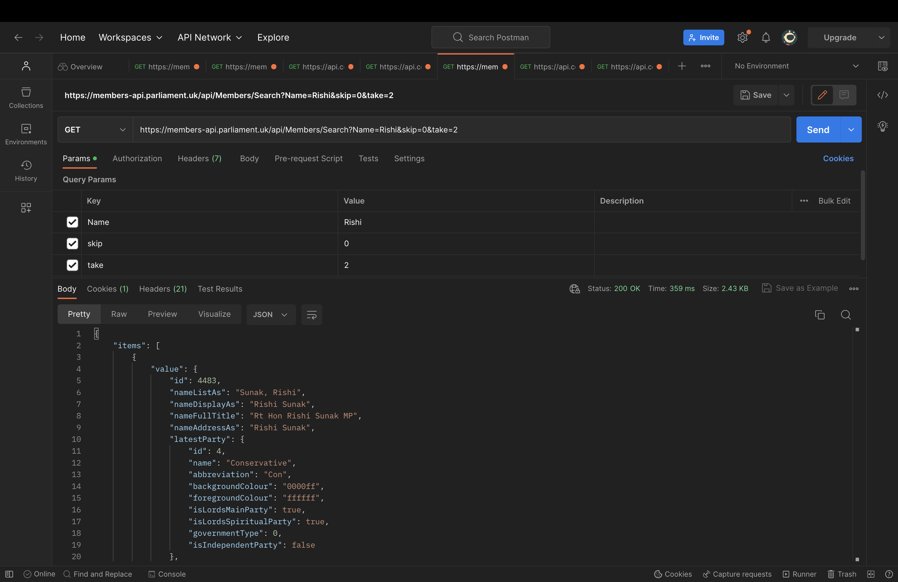
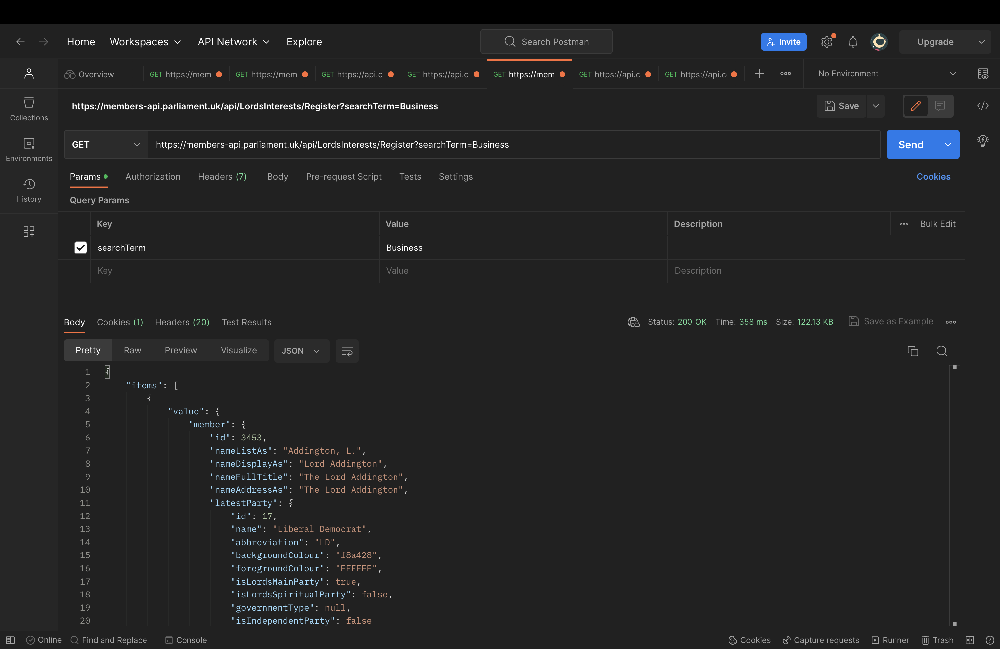

#  🏛 The US Congress & The UK Parliament 🏛

A website by the Lally Enthusiasts

## Project Description

This is version 2 of our website from Assignment 5 with additional Router & Redux elements. The US Congress & The UK Parliament website is a dynamic React-based web application that calls APIs from two distinct sources: the Congress API and the Parliament API. The website compares information between the members and treaties of the United States Congress and the members and treaties of the UK Parliament. Users can search for specific members and retrieve details about their respective legislatures. 

### Project Features

- **Congress Page:** Allows users to search for members of the United States Congress by their unique BioGuide ID from the Biographical Directory of Congress. It provides information such as full name, member type, state, and party affiliation. It also has a treaty search feature where the user can input a treaty number to retrieve the transmitted date and treaty subject. 

- **Parliament Page:** Enables users to search for members of the UK Parliament by their names. It displays details like full name, gender, party, latest membership placement, start date, end date (if not in office), and membership status. It displays the registered interests based on the users input and displays members or individuals who have an interest or association with that particular search term.

## APIs Used

### 1. Congress API
- **Name:** Congress API
- **API Provider:** [congress.gov](https://www.loc.gov/apis/additional-apis/congress-dot-gov-api/ )
- **Extra Documentation:** [Congress Brief Endpoints Documentation](https://github.com/LibraryOfCongress/api.congress.gov/blob/main/Documentation/BriefEndpointsDocumentation.md#treaty)
- **Description:** The Congress API provides information about members and treaties of the United States Congress.
- **Postman:** 

    
    

### 2. Parliament API
- **Name:** Parliament API
- **API Provider:** [members-api.parliament.uk](https://members-api.parliament.uk/index.html)
- **Extra Documentation:** [Parliament Developer Hub](https://developer.parliament.uk/)
- **Description:** The Parliament API offers data about members and treaties of the UK Parliament.
- **Postman:** 

    
    

### API Implementation

#### Congress Page

- **Member Search:** Users can search for Congress members by their BioGuide ID, which is a unique identification for each member.
- **Information Display:** Upon searching, the website fetches data from the Congress API, including the full member name, member type, state, party, and an image. This data is then displayed on the page.
- **Treaty Search:** Users can search for treaties using a treaty number, retrieving details such as treaty subject and transmitted date.

#### Parliament Page

- **Member Search:** Users can search for UK Parliament members by their names.
- **Information Display:** The website sends an HTTP GET request to the Parliament API, retrieves data, and displays it. This data includes full names, genders, party affiliations, membership placements, start dates, end dates (if applicable), and membership statuses.
- **Registered Interests:** Users can search for members' registered interests based on specific search terms. The website retrieves the list of members with interests related to the search term and displays their names.

### Router Requirements

- **Add multiple paths (3 or more) to your project, managed by a router:** In our `app.js` file, we set up routes for the homepage, Congress page, Parliament page, and a NotFound page. The `<Routes>` component in `app.js` defines paths for the homepage, Congress, Parliament, and any other route (*) that doesn't match fulfilling the requirement for multiple paths.
- **Add at least one nested route:** In homepage.js, we use `<Outlet/>` which for nested routes with our actual nested routes being `/API-app/congress` and `/API-app/parliament`.
- **Enable client side routing:** We used react-router-dom in app.js to enable client-side routing and the `<BrowserRouter>` component in `app.js` enables client-side routing, allowing navigation without full page refreshes.
- **Each page should have some meaningful, unique functionality from the API assignment:** Both the Congress and Parliament pages fetch and display information from their respective APIs based on user input. The Congress page allows users to search for members and treaties, while the Parliament page allows users to search for members and their registered interests.
- **Add an error element:** The `NotFound` component is rendered when a route that doesn't exist is accessed. `<Route path="*" element={<NotFound/>} /> {}` serves as an error page for non-existent routes, providing a user-friendly error message that can be found in `NotFound.js`

### Redux Requirements

- **Create a Redux store to manage your app's state:** The `store.js` file creates a Redux store using `configureStore` from `@reduxjs/toolkit` and the store constant in `store.js` is the Redux store that manages the state for both the Congress and Parliament slices.
- **Manage all state changes with actions, sent via dispatch:** In both `CongressSlice.js` and `ParliamentSlice.js`, we defined actions (`setMemberInfo`, `setTreaty`, `setError`, etc.) that are dispatched to trigger state changes. These actions are dispatched in `Congress.js` and `Parliament.js` to manage state changes.
- **Unique actions should have unique types:** Each action type is unique. For example, `setMemberInfo`, `setTreaty`, and `setError` have distinct types which ensures that each action has a clear and unique identifier.
- **At least one action should have a payload field:** Actions like setMemberInfo and setTreaty have payload fields that carry data. The payload field allows passing relevant data to update the state.
- **Create reducers to handle incoming actions:** In both `CongressSlice.js` and `ParliamentSlice.js`, we have reducers that handle the state changes based on dispatched actions. These reducers specify how the state changes in response to actions.
- **Create one or more selectors for getting the store's state:** A selector takes the Redux state as an argument and returns a specific piece of that state. Our `selectCongressMemberInfo` does that as defined in the `CongressSlice.js` file and is then used in `Congress.js`.

#### Extra Features
- **Styling:** We added cohesive styling and maintained similar layouts for both pages
- **Edge Cases:** We solved edge cases related to rendering components
- **Clarifying Comments:** We added comments to describe what each section of the code does to follow along for anyone to understand.

## GitHub Workflow

Each team member has authored at least one pull request (PR) containing a feature with an API call. All code changes were made using the feature branch workflow, app is deployed on Netlify. Each PR received at least one approval from a teammate before being merged and we actively reviewed and contributed to each other's PRs because the Lally Enthusiasts support each other through thick and thin.
- The repository link is https://github.com/DavidA123777/API-APP-V2.git
- The website (deployed on netlify instead of github pages) link is https://main--enchanting-kashata-808130.netlify.app/ 
